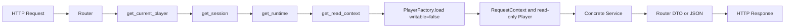
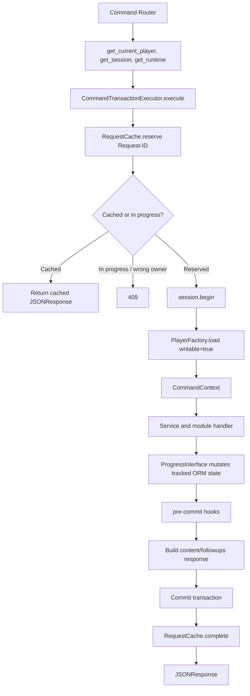

# Endpoint Flow V1

本文描述当前 Mythos API 从 HTTP 端点入口到响应返回的调用链，以及请求在 Router、依赖、Runtime、Player、Service、Catalog、数据库事务和 checkpoint 文件系统之间的流动方式。

## 1. 启动期组装

`create_app()` 的 lifespan 在接受请求前完成以下组装：

```text
Settings + RegistryBundle
  -> StaticAssetPublisher.materialize(files.sources)
  -> RegistryBundle.materialize_static_files(object_references)
  -> RegistryBundle.freeze(file_ids)
  -> RuntimeCatalogs(files, progress, scripts, validations)
  -> PlayerFactory(catalogs)
  -> LocalCheckpointStore + ProgressCheckpointHook
  -> CommandTransactionExecutor(factory, RequestCache, hooks)
  -> ServiceContainer(files, progress, scripts, validations)
  -> ApplicationRuntime
  -> app.state.runtime / app.state.database / app.state.settings
```

Router 不自行构造 Service 或 Catalog。它通过 FastAPI 依赖取得 `ApplicationRuntime`，再使用其中已经冻结的 Catalog、全局 Service、PlayerFactory 和命令 Executor。

| 组件 | 请求期职责 |
| --- | --- |
| Router | HTTP 参数、依赖声明、异常到 HTTP 状态码映射、响应序列化 |
| `get_current_player()` | 验证 Bearer JWT，生成最小 `PlayerIdentity` |
| `get_session()` | 为一次请求提供 AsyncSession，离开依赖后关闭 |
| `get_read_context()` | 加载 `writable=False` 的 Player，生成 `RequestContext` |
| `PlayerFactory` | 加载 `PlayerProgress`、unlocked/frontier、当前 checkpoint metadata，并创建 Interface |
| `ProgressInterface` | 读取/写入当前 Session 追踪的玩家图状态 |
| Service | 使用 Catalog、Player 或 Context 执行具体用例，不保存请求状态 |
| `CommandTransactionExecutor` | Request-ID、事务、可写 Context、pre-commit hook、响应缓存 |
| `StaticAssetPublisher` | 启动期同步注册的本地静态 Source、RustFS 对象版本与 SQLite 登记表 |

## 2. 当前端点分类

| 类别 | 端点 | 玩家进度写入 | Request-ID |
| --- | --- | --- | --- |
| 无状态读取 | `GET /health` | 否 | 否 |
| 认证 | `POST /auth/register`、`login`、`refresh`、`logout` | 注册时初始化 entry；其余写认证状态 | 否 |
| 只读内容 | `GET /files/ls`、`GET /files/tree`、`GET /files/{file_id}`、`GET /scripts`、`GET /progress` | 否 | 否 |
| 缓存版本校验 | `GET /files/version` | 否 | 否 |
| 只读内容操作 | `GET /files/{file_id}/{content_token}/content-url`、`download-url` | 否 | 否 |
| 命令 | `POST /validations/{validation_id}/attempts` | 可写 | 是 |
| 命令 | `POST /progress/checkpoints/restore` | 可写 | 是 |

文件预签名 URL 端点使用版本化 `GET`，但它只读取 Player 和 FileTree 并调用对象存储，不写入 SQLite 玩家状态，因此属于只读内容操作。`tree_version` 仅标识静态 FileTree；玩家进度版本由 Progress API 独立提供。

## 3. 受保护读操作

除 `/health`、认证入口与只读取静态 `tree_version` 的 `GET /files/version` 外，读端点共享以下前半段：



`PlayerFactory.load()` 查询 `PlayerProgress` 与 select-in 关系：unlocked 节点、frontier 节点；若 `current_checkpoint_sequence >= 0`，还会查询该序号的 checkpoint metadata。它将同一份 `RuntimeCatalogs` 注入 `ProgressInterface`，但只读 Player 的所有写方法都会抛出 `ReadOnlyPlayerError`。

### 3.1 FileService

```text
GET /files/ls?path=/
   -> FileService.list_directory(player, path)
   -> FileTree.directory_chain(path)
   -> 按路径链执行每个 Node access_rule(player)
   -> 仅检查直接子 Node access_rule(player)
   -> DirectoryListing
   -> {path, directories, files}

GET /files/tree?path=/
   -> FileService.directory_tree(player, path)
   -> FileTree.directory_chain(path)
   -> 按路径链执行每个 Node access_rule(player)
   -> 递归构造当前玩家可见的子树
   -> {path, display, directories, files}

GET /files/{file_id}
  -> FileService.metadata(player, file_id)
  -> FileTree.file_chain(file_id) + access_rule
  -> FileMetadata
  -> JSON
```

`GET /files/{file_id}/{content_token}/content-url` 与 `download-url` 在完成相同的 FileTree/权限检查后验证内容 token，再调用 `ObjectStore.presign_get()`。content URL 返回 `{url, expires_at, content_token}`，使用浏览器私有缓存且缓存期短于签名 TTL；download URL 使用 `no-store`。文件未知为 `404`，已知但无权限为 `403`，过期 token 为 `412`，对象存储不可用为 `503` 或 `502`。

### 3.2 ScriptService 与 ProgressService

```text
GET /scripts
  -> ScriptService.visible(player)
  -> ScriptCatalog.visible(player)
  -> Script access_rule(player)
  -> {items: [...]}

GET /progress
  -> ProgressService.snapshot(player)
  -> ProgressGraph.str_ids_by_node_id
  -> {current_account, unlocked_nodes, frontier_nodes,
      checkpoint_sequence, version}
```

数据库与 checkpoint 文件使用数字节点 ID；`GET /progress` 在返回响应前映射为模块可读字符串 ID。读端点的响应不使用命令响应包装。

## 4. 认证写操作

认证 Router 不使用 `CommandTransactionExecutor`，而是为每次请求创建持有当前 AsyncSession 的 `AuthService`。

```text
POST /auth/register
  -> CredentialsRequest 校验
  -> AuthService.register()
  -> asyncio.to_thread(Argon2 password hash)
  -> session.begin()
       创建 PlayerRecord、PlayerAuth、PlayerProgress
       从 RuntimeCatalogs.progress 写入 entry unlocked/frontier
  -> commit
  -> JWT access token + HttpOnly refresh cookie + 201
```

`login` 与 `refresh` 在各自事务中验证凭据并轮换 refresh credential；`logout` 先验证 Bearer JWT，再清除 refresh credential。认证成功响应返回 `{access_token, expires_in}`，并用 `Set-Cookie` 写入或删除 refresh cookie，同时设置 `Cache-Control: no-store`。

## 5. 通用命令写路径

Validation 与 checkpoint restore 都使用同一命令执行器：



命令成功时 Executor 将 Service 的 `ResponseSpec.body` 包装为：

```json
{
  "content": {},
  "followups": []
}
```

只有事务成功提交后，最终响应才进入进程内 `RequestCache`。异常、`context.reject()`、非法 followup、非法响应或 hook 失败都会退出 `session.begin()`，回滚 ORM 更改并释放 Request-ID 占位。

### 5.1 Validation 命令

```text
POST /validations/{validation_id}/attempts
  -> ValidationService.attempt(validation_id)
  -> ValidationCatalog.attempt() 查找注册 handler
  -> Executor.execute(...)
  -> ValidationService.submit(context, attempt, payload)
  -> module handler(context, payload)
  -> context.player.progress.push(id, branch_arg)
  -> ValidationOutcome(accepted)
  -> ResponseSpec({accepted})
```

`push()` 将字符串节点 ID 映射为 Graph 数字 ID，检查当前 frontier，更新 unlocked/frontier，解析可用的 AND/OR Merge，并更新版本号。非法图转移映射为 `409`；未知 validation 为 `404`。同一玩家重放已完成的 Request-ID 返回缓存的完全相同响应，其他玩家使用该 ID 返回 `409`。

### 5.2 Checkpoint pre-commit hook

当一次 `push()` 的稳定结果新解锁了 checkpoint 节点，`ProgressInterface` 将数字 unlocked/frontier 集合、Graph Hash、玩家 ID 与分配序号放入请求级 pending 队列。

```text
ProgressCheckpointHook
  -> progress._drain_pending_checkpoints()
  -> LocalCheckpointStore.write(snapshot)
       -> asyncio.to_thread()
       -> temporary JSON -> flush -> fsync -> os.replace()
  -> session.add(PlayerProgressCheckpoint)
  -> progress._set_current_checkpoint(last_record)
  -> command transaction commit
```

文件落盘先于 checkpoint metadata 写入，避免数据库记录指向尚未生成的文件。若数据库最终回滚，正式文件可能成为孤儿；它不对应可恢复 metadata，应由后续清理任务处理。

## 6. Checkpoint 恢复命令

```text
POST /progress/checkpoints/restore
  -> CommandTransactionExecutor
  -> PlayerFactory 加载 current checkpoint metadata
  -> ProgressService.restore(context)
  -> LocalCheckpointStore.read(storage_key) in asyncio.to_thread
  -> 校验 format、player_id、sequence、Graph structure_hash
  -> ProgressInterface._restore_state(unlocked, frontier)
  -> Executor commit + cached {content: {progress: ...}, followups: []}
```

`current_checkpoint_sequence == -1` 或缺少 metadata 返回 `404`。文件不可读、玩家/序号不匹配、Graph Hash 不同、未知节点或不合法 frontier 返回 `409`。恢复成功后，响应与 `GET /progress` 相同的投影位于命令响应的 `content.progress`。

## 7. 响应与失败边界

| 场景 | 响应形态 | 状态 |
| --- | --- | --- |
| 普通读服务 | Service DTO 直接 JSON | 200 |
| 文件预签名 | `{url, expires_at}` | 200 |
| 认证成功 | token JSON + refresh cookie | 200 或 201 |
| 命令成功 | `{content, followups}` | Service 指定，当前为 200 |
| JWT 缺失/失效 | `{detail}` + `WWW-Authenticate` | 401 |
| Request-ID 执行中/跨玩家 | `{detail}` | 409 |
| 命令拒绝或非法进度转移 | `{detail}` | 409 或 handler 指定状态 |
| command hook 文件 I/O 失败 | 事务回滚、Request-ID 释放；未被具体 Router 映射时为 FastAPI 500 | 500 |

`RequestCache` 是应用进程内、短 TTL 的幂等控制，不是数据库持久化的请求日志。跨进程部署需要共享缓存或数据库级幂等策略后，才能获得相同的跨实例保证。
